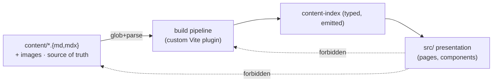
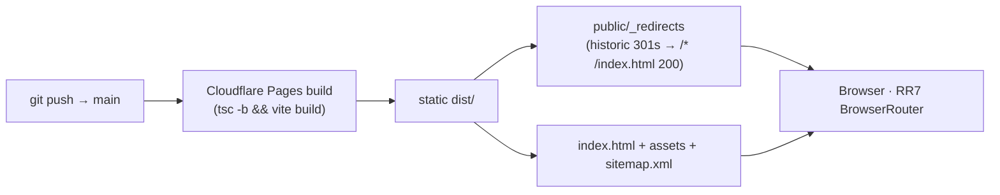

# Architecture Spine — clintonjavery.com reimagining

## Design Paradigm

**File-based content collection, build-time data, presentational runtime** — a static-publishing pipeline running over the existing Vite build. Three layers with a one-way dependency:

- **Content layer** (`content/`) — the source of truth: frontmatter + MDX/markdown body + co-located images. Data, not code. Authored per post via git.
- **Content pipeline** (`src/content/` + one Vite plugin) — build-time only: globs `content/`, parses frontmatter (`gray-matter`), compiles MDX (`@mdx-js/rollup`), validates, and emits a typed `content-index`. No runtime fetch.
- **Presentation layer** (`src/`) — React 19 + React Router 7. Reads only the emitted content index; renders routes. No business logic.



## Invariants & Rules

### AD-1 — Layer boundaries are one-way

- **Binds:** all
- **Prevents:** presentation depending on raw content files; content depending on app code; the two evolving incompatibly.
- **Rule:** `src/` imports from the emitted `content-index` only — never globs or imports `content/` directly. `content/` files import nothing from `src/` and contain no application code. The build pipeline is the only path between them.

### AD-2 — One content collection, one shared shape

- **Binds:** FR-6, FR-7, FR-8, FR-10, FR-15; Landing, Feed, Post
- **Prevents:** two consumers reading different Post shapes; a comic shipping without alt text; per-post SEO drifting from the post itself.
- **Rule:** All Posts are members of a single collection rooted at `content/p/<slug>.md(x)`. The Post frontmatter schema (PRD addendum §B) is the authoritative data contract: `slug` (= filename, kebab-case), `title`, `date` (ISO 8601), `type ∈ {essay, comic}`, `excerpt` (optional), `tags` (optional); comic posts add `strip.image` + non-empty `strip.alt`; essay posts add a markdown/MDX body. The emitted `content-index` exposes one typed `Post[]` — the only Post type any consumer uses. A comic post with absent/empty `strip.alt` fails the build (FR-8, AD-4).

### AD-3 — Content is loaded at build time (no runtime fetch)

- **Binds:** FR-4, FR-15; build
- **Prevents:** a runtime CMS/fetch path diverging from the static pipeline; a post appearing only after a client request.
- **Rule:** The collection is materialized into the bundle at build time via `import.meta.glob('/content/p/**/*.{md,mdx}', { eager: true })`. No `fetch`/API/network call reads content at runtime. Feed pagination, type filter, and "Latest" operate over the in-memory emitted index.

### AD-4 — One Vite plugin owns build, validation, and per-post SEO/sitemap

- **Binds:** FR-8, FR-10, FR-11; build
- **Prevents:** invalid posts shipping; missing/incorrect OG/Twitter meta; a hand-maintained sitemap drifting from the collection.
- **Rule:** A single custom Vite plugin runs inside `vite build` and, in one pass: (a) builds the typed `content-index`; (b) **fails the build** if any comic post lacks non-empty `strip.alt` (the FR-8 gate); (c) emits per-post `<title>`, meta description, and Open Graph/Twitter Card tags with `ogImage` (the strip image for comics, a per-post or default image for essays) into each rendered Post's document head; (d) emits `/sitemap.xml` and `/robots.txt`; (e) emits `/og`-image routes if needed. The authored build command stays minimal: `tsc -b && vite build` — no separate prebuild script.

### AD-5 — Routes are a fixed contract; per-post routes are content-derived

- **Binds:** FR-13, FR-14; UX IA
- **Prevents:** hand-registered per-post routes drifting from the collection; route/content mismatch.
- **Rule:** React Router 7 `BrowserRouter` (client-side). Fixed routes: `/` (Landing), `/p` (Feed, with `?type=all|essay|comic`), `/projects`, `/projects/:slug` (live tool demos). Dynamic: `/p/:slug` for every Post, generated from the collection — no per-post `<Route>` hand-added. All in-app navigation uses RR `<Link>` (no full-page reload). (Confirmed route scheme, PRD OQ1.)

### AD-6 — Styling is Tailwind v4 + DESIGN.md tokens only; contrast is build-gated

- **Binds:** FR-1; all presentation; UX design contract
- **Prevents:** style drift from the Ink-&-Garden system; the green/orange-on-paper pairs that fail WCAG 2.1 AA (the UX open gate) shipping.
- **Rule:** Tailwind v4 wired via `@tailwindcss/vite` (no PostCSS) and `@import "tailwindcss"` in a single `src/styles.css`; the `@theme` block maps every token from `DESIGN.md` (Ink & Garden) by name. New UI uses Tailwind utility classes referencing `@theme` tokens; CSS Modules are retired per-component as it is rebuilt (no new CSS Modules). No inline hex literals in components. A build-time contrast check (in the plugin or a small `scripts/`, AA) asserts the load-bearing token pairs — Primary link-on-Surface, white-on-Primary, and any Secondary-as-text usage — and fails the build if under 4.5:1, locking the darker-green variants named in `DESIGN.md` (`#256628` / `#26702C`) where required.

### AD-7 — Deploy is Cloudflare Pages; redirects before SPA fallback

- **Binds:** FR-15; platform; PRD OQ1
- **Prevents:** broken historic inbound links; SPA 404s on deep links; the stale Azure deploy path persisting.
- **Rule:** The site deploys as static assets to **Cloudflare Pages** via git auto-deploy on `main`. The GitHub Actions Azure Storage/CDN workflow (`.github/workflows/deploy.yml`) is **retired**. `public/_redirects` is the redirect contract, ordered: (1) historic 301s first (`/writing/:slug → /p/:slug 301`, `/comics → /p?type=comic 301`, `/tools/:slug → /projects/:slug 301`, `/fun/:slug → /projects/:slug 301`, `/about → / 301`, etc.); (2) `/* /index.html 200` **last** so React Router owns unmatched paths. No other deploy target exists.

## Consistency Conventions

| Concern | Convention |
| --- | --- |
| Naming | Post `slug` = kebab-case filename in `content/p/`; project `slug` = kebab-case; TS modules PascalCase for components, camelCase for utilities. |
| Data & formats | Dates ISO 8601 (`YYYY-MM-DD`) in frontmatter; MDX/markdown body for essays; images co-located under `content/p/<slug>/` or `public/content/`, referenced by absolute path (`/content/...`); `ogImage` path or derived from `strip.image`. |
| State & cross-cutting | No runtime mutation — static site. Config via `import.meta.env.*` (build-time) only. No auth, no persistence. Errors are build-time (vite build fails); runtime has no error surface beyond per-route not-found + image-load-failure states (UX §State Patterns). |
| Logging | None at runtime; build diagnostics to stdout only. |

## Stack

SEED — verified current at authoring from the existing `package.json`; the code owns it once it exists. New deps marked for install-time verification.

| Name | Version |
| --- | --- |
| React / react-dom | 19.0.0 |
| react-router-dom | 7.4.0 |
| Vite | 6.2.0 |
| @vitejs/plugin-react-swc | 3.8.0 |
| TypeScript | ~5.7.2 (strict) |
| Tailwind CSS | 4.0.14 (wired via `@tailwindcss/vite`) [ASSUMPTION: add `@tailwindcss/vite` plugin, verify latest at install] |
| @mdx-js/rollup | [ASSUMPTION: pin latest at install, verify on web] |
| gray-matter | [ASSUMPTION: pin latest at install, verify on web] |
| luxon | 3.6.0 (existing) |
| react-icons | 5.5.0 (existing) |
| @radix-ui/react-slider | 1.3.5 (existing — candidate for the zoom control, or custom) |
| Platform | Cloudflare Pages (static) |

## Structural Seed

```text
clintonjavery/
  content/p/<slug>.md(x)        # Post source of truth (frontmatter + body + co-located images)
  src/
    content/
      plugin.ts                 # the custom Vite plugin (AD-4): glob, validate, index, meta, sitemap
      index.ts                  # emitted typed content-index (generated, git-ignored)
      schema.ts                 # Post frontmatter schema (auth. matches PRD addendum §B)
    pages/  Landing Feed Post Projects ProjectShow  # RR routes per AD-5
    components/  ...             # Ink & Garden components (Tailwind, AD-6)
    styles.css                  # @import "tailwindcss"; @theme { …DESIGN.md tokens… }
    App.tsx main.tsx             # RR7 routes (content-derived /p/:slug)
  public/
    _redirects                  # 301s first, /* /index.html 200 last (AD-7)
    _headers robots.txt          # static
    content/                    # co-located strip/og images (if not beside the post)
  vite.config.ts                # plugins: [react(), mdx(), tailwindCss(), contentPlugin()]
```



## Capability → Architecture Map

| Capability / Area | Lives in | Governed by |
| --- | --- | --- |
| FR-1/2/3 Landing (identity hero, scroll narrative, Latest) | `pages/Landing`, `components/*` | AD-1, AD-6 |
| FR-4/5 Feed (unified, Type Filter, pagination) | `pages/Feed` over `content-index` | AD-2, AD-3, AD-5 |
| FR-6/7 Post render (essay/comic, type semantics) | `pages/Post` | AD-2, AD-5 |
| FR-8 mandatory comic alt (build gate) | `content/plugin.ts` | AD-4 |
| FR-9 Projects (absorbs Tools/Fun) | `pages/Projects`, `pages/ProjectShow`, migrated tools under `src/tools` | AD-5 |
| FR-10 per-post SEO/OG + ogImage | `content/plugin.ts` (meta emission) | AD-4 |
| FR-11 site identity metadata | root document head (plugin) | AD-4 |
| FR-12 Support affordance | `components/SupportPill` on content pages | UX §Component Patterns |
| FR-13/14 client-side nav (no full reload) | RR7 `<Link>` everywhere | AD-5 |
| FR-15 migration (16 essays → `content/p/*.mdx`; historic redirects) | one-time migration + `public/_redirects` | AD-2, AD-7 |
| FR-16 comic zoom/pan | `components/ComicViewer` | UX §Comic Presentation; AD-6 (token contrast) |

## Deferred

- **Per-story detail** of the ComicViewer zoom inputs — UX EXPERIENCE.md §Comic Presentation is the contract; exact pointer-events/keyboard wiring is story-level.
- **Test framework** — none today; introduce Vitest at the story that needs it (validation logic, ComicViewer a11y). Revisit when first behavior with branching lands.
- **Image optimization / responsive images** — not required for v1; Cloudflare image resizing or `srcset` is a fast-follow, not a v1 invariant.
- **RSS/Atom feed** — out of PRD scope; trivially derivable from `content-index` later.
- **Subscribe/follow** — explicitly out of v1 (PRD); design must not preclude.
- **Analytics** — none specified; if added later, privacy-first, build-config-injected only.
- **Paywall** — explicitly out of v1 (PRD); the content-pipeline must not be structured in a way that makes it hard to add later.